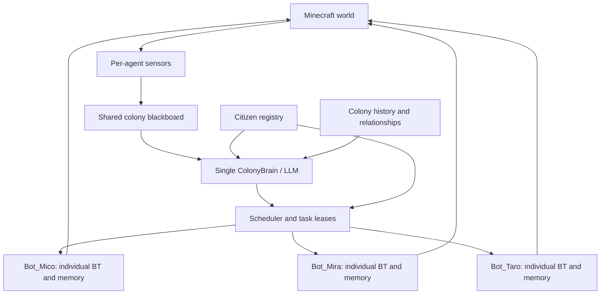

# Sorim Colony Roadmap

## Goal

Sorim will evolve from a group of cooperating bots into a persistent Minecraft
colony controlled by one high-level AI brain. Each body will still have its own
sensors, safety reflexes, task state, profession, identity, relationships, and
memories.

The architecture must also remain fully usable in solo survival. A single bot
cannot depend on colony storage, another profession, or a scheduler peer to
reach a starter base and the iron age.

Personality and emotion in this system are simulated behavioral models. They
shape dialogue, preferences, relationships, and social rituals; they never
override survival rules, tool validation, protected zones, or task verification.



## Design Rules

- One loaded LLM serves the whole colony; requests are queued and summarized.
- The LLM makes social and high-level planning decisions, not movement ticks.
- Each bot owns a behavior tree for combat, hunger, navigation, and tool use.
- A character profile affects style and preferences, not physical competence.
- Addressing `Mico` routes the message to Mico's identity and conversation memory.
- Names are unique, short, pronounceable, and separate from Minecraft usernames.
- Dead citizens remain immutable historical records and are never silently reused.
- Replacement citizens receive new identities and must earn relationships and roles.

## Character Profile

Each citizen will have a persistent profile similar to this:

```json
{
  "id": "citizen_0007",
  "username": "Bot_Mico",
  "shortName": "Mico",
  "displayName": "Mico",
  "aliases": ["Mico", "Miço", "mico", "miço"],
  "status": "alive",
  "profession": "lumberjack",
  "traits": {
    "sociability": 0.82,
    "courage": 0.58,
    "curiosity": 0.73,
    "discipline": 0.66,
    "generosity": 0.79,
    "ambition": 0.41
  },
  "speech": {
    "tone": "warm and practical",
    "verbosity": "short",
    "catchphrases": []
  },
  "values": ["cooperation", "safe exploration"],
  "preferences": {
    "jobs": ["lumberjack", "builder"],
    "dislikedJobs": ["fisher"]
  },
  "relationships": {},
  "reputation": {
    "trust": 0.5,
    "competence": 0.5,
    "service": 0
  },
  "createdAt": "2026-08-08T00:00:00.000Z"
}
```

The dialogue prompt receives only the addressed citizen's profile, recent
conversation, important memories, current state, and relevant colony summary.
The response is spoken by that citizen. Other bots do not answer unless the
message addresses the colony or no name can be resolved. Unicode chat aliases
such as `Miço` can resolve to an ASCII-safe Minecraft username such as
`Bot_Mico`.

## Current Progress

- Completed: 4096/8192 context benchmark and 4096 default selection.
- Completed: state-based task verification, persisted verification evidence, retries, and task tool timeout.
- Completed: dynamic material/base/terrain/mining-kit preconditions.
- Completed: controlled live `16 logs -> base -> return -> chest` run.
- Completed: rolling conversation summaries, persisted commitments, and proactive task result reports.
- Completed: colony lease ownership, expiry, renewal, and disconnect release primitives.
- Completed: centralized `ColonyBrain`, compact `ColonyBlackboard`, persistent work-order scheduler, resource reservations, retries, and disconnect reassignment.
- Completed: persistent `CharacterRegistry`, deterministic Mico and Mira profiles, and name-routed Mico dialogue prompts.
- Completed: per-body `safety -> scheduled work -> idle` behavior trees, long-tool timeout, and in-flight drowning/hostile interruption.
- Completed: natural survival settlement center derived from actual spawn positions; an explicit coordinate is no longer treated as a verified base.
- Live verified: lumberjack assignment, survival hunger override, protected-area-aware target selection, and full six-log oak chopping.
- Live verified: Paper 26.2 two-body connection, local spider evasion, timeout cancellation, retry state, and rejection of unverified wood/stone results.
- Still pending live coverage: complete farmer/rancher, fisher, and miner profession runs in controlled terrain.
- Still pending live coverage: command-enabled controlled two-agent run through shared chest creation, verified deposit/withdraw, and forced disconnect reassignment.
- Next milestone: controlled profession fixtures and a full solo starter-base-to-iron regression, followed by the two-agent shared-storage run.

## Implementation Order

### Phase 1: Reliable Work

1. Add state-based task verification for inventory deltas, base arrival,
   storage deposits, fishing, mining, and construction.
2. Add a precondition resolver that inserts missing tools, food, materials, and
   base requirements before a task runs.
3. Run corrected solo and profession tests before increasing colony size.

### Phase 2: Single Brain, Multiple Bodies

1. Add `ColonyBrain` for high-level goals, diplomacy, and role decisions.
2. Add a scheduler with task leases, reservations, deadlines, retries, and
   reassignment after disconnects.
3. Publish compact per-agent observations to a shared colony blackboard.
4. Reserve chest items, blocks, farms, trees, and mining regions to prevent
   duplicate work and griefing.
5. Keep urgent safety local so combat and drowning never wait for the LLM.

### Phase 3: Persistent Citizens

1. Add `CharacterRegistry` and persistent identity files.
2. Add deterministic starter profiles, including `Bot_Mico` / `Mico`.
3. Route chat by short name, username, aliases, and colony-wide address.
4. Build personality-conditioned dialogue and bounded action preferences.
5. Track relationships with players and citizens through concrete events such
   as help, gifts, fulfilled tasks, abandonment, and friendly damage.
6. Add a seeded random character generator for later citizens.

### Phase 4: Social Colony

1. Add requests between professions, such as a miner requesting food or tools.
2. Add promises and commitments with completion and failure records.
3. Add meetings only for infrequent strategic decisions; ordinary work remains
   asynchronous and does not require every bot to stop.
4. Add proactive but rate-limited dialogue for discoveries, danger, shortages,
   completed projects, and remembered player events.

### Phase 5: Leadership Elections

1. Create fixed election intervals and emergency succession conditions.
2. Score candidates using observed trust, competence, colony service,
   reliability, and personality-compatible priorities.
3. Let citizens cast explainable private votes; the LLM may express reasons but
   cannot invent scores or alter ballots.
4. Give the elected president bounded powers: select strategic goals, resolve
   task priority ties, and call colony projects.
5. Keep safety, player ownership commands, and protected-zone rules above the
   president's authority.

### Phase 6: Death, Memorials, And Succession

1. Record death position, cause, inventory loss, witnesses, active task, and
   final important episode.
2. Mark the citizen deceased and cancel or reassign leases immediately.
3. Recover items only when the route is safe and policy allows it.
4. Select a safe memorial site and build a small grave from a validated
   blueprint without damaging existing builds.
5. Store the citizen's name, profession, service summary, and dates on the
   memorial where server capabilities permit.
6. Add a new randomly generated citizen only after a configurable delay and
   colony capacity check. The new citizen does not inherit the deceased
   citizen's memories or relationships.
7. Preserve memorials and deceased profiles in colony history.

## Election Model

Personality influences priorities and candidate affinity, but elections should
remain grounded in observable history. A first scoring model can use:

```text
candidate score = 30% trust + 30% competence + 25% service
                + 15% voter-value alignment
```

This prevents a charismatic profile from winning solely because its prompt says
it is charismatic. Every result should be reproducible from stored inputs and
written to the colony history.

## Random Character Generator

The generator should use a saved seed and constrained tables for:

- unique short name and Minecraft-safe username
- six normalized core traits
- two or three values
- preferred and disliked professions
- speech tone and response length
- one harmless habit or interest

Generated traits must not disable safety, create hostility toward protected
groups, or grant skills the bot has not learned. Random generation is planned
after deterministic profiles are stable so failures remain reproducible.

## Acceptance Tests

- A solo bot reaches a verified starter base and iron age without any colony service.
- Calling `Mico` causes only Mico to answer in Mico's stable style.
- Mico remembers a player's name and important prior commitments after restart.
- Two bots cannot hold the same exclusive task or resource lease.
- A disconnected or dead worker's task is reassigned without duplicate deposits.
- Personality changes a valid preference between tasks but never bypasses safety.
- Election results can be reconstructed from persisted scores and ballots.
- A death creates a historical record, safely cancels work, and schedules one
  non-griefing memorial task.
- A successor has a new ID, new personality, and no fabricated memories.

## Immediate Next Work

The central brain, blackboard, scheduler, character registry, name routing, and
local body trees are implemented. The next coding and test milestone is a set
of controlled profession fixtures, followed by the full solo survival gate and
the command-enabled two-agent shared-storage/failover run. Natural-world smoke
tests remain useful, but they are not substitutes for reproducible fixtures.
